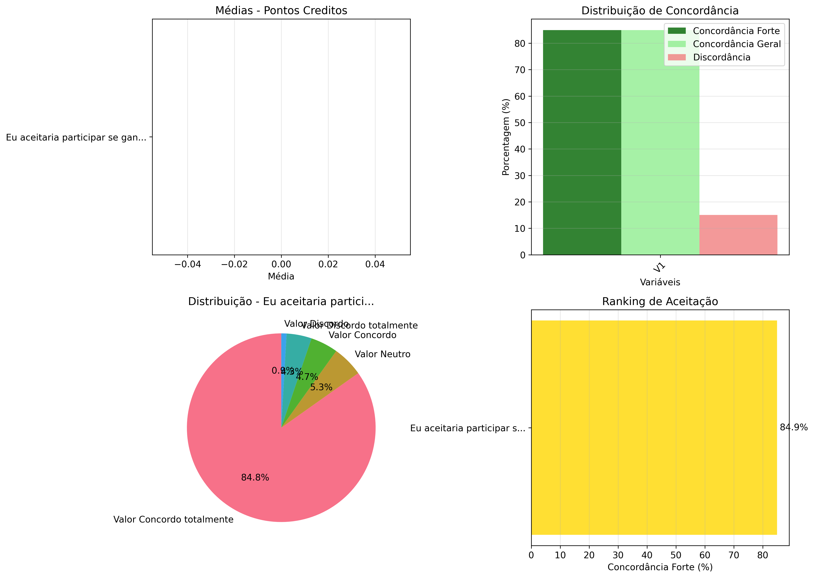
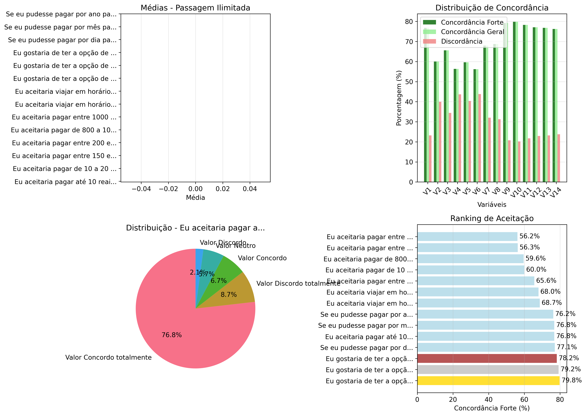
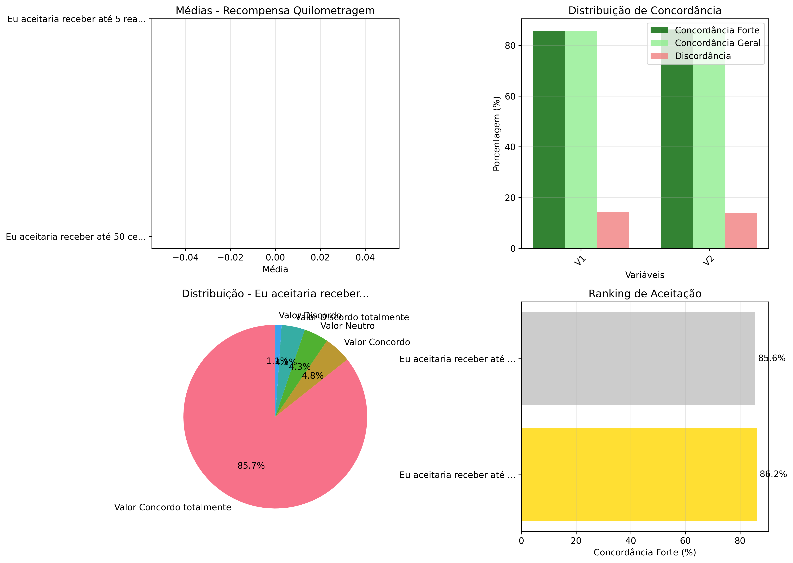
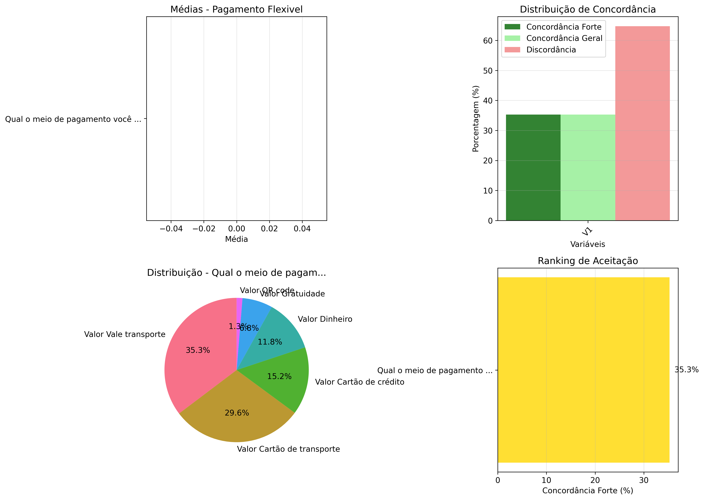

# Análise Completa de Disposição a Pagar (WTP) e Percepção de Recompensas

## 📋 Sumário Executivo

Esta análise examina detalhadamente a **disposição a pagar (WTP)** e a **percepção de recompensas** dos usuários de transporte público, incluindo **testes estatísticos robustos** para comparação entre grupos socioeconômicos.

### 🎯 Objetivos Atendidos

✅ **Análise por categorias** de recompensas (pontos, passagens, descontos, etc.)
✅ **Correção do problema das proporções 0.0%** - agora com análise adequada por tipo de escala
✅ **Testes de diferença de médias** (t-test e Mann-Whitney U) entre grupos
✅ **Interpretação didática** de cada resultado estatístico
✅ **Visualizações elucidativas** para cada categoria
✅ **Cálculo de tamanho do efeito** (Cohen's d) para medir relevância prática

## 🔬 Metodologia Aplicada

### Preparação dos Dados
1. **Carregamento**: Integração de múltiplos datasets CSV
2. **Identificação automática**: Classificação de variáveis por tipo (WTP, percepção, intenção)
3. **Limpeza**: Tratamento de valores ausentes e outliers

### Análise Estatística
1. **Identificação de escalas**: Likert (1-5), binária, categórica ou contínua
2. **Estatísticas descritivas**: Média, mediana, desvio padrão, frequências
3. **Cálculo de concordância**:
   - **Concordância forte**: Notas 4-5 (ou equivalente)
   - **Concordância geral**: Notas 3-5 (ou acima da mediana)
   - **Discordância**: Notas 1-2 (ou abaixo do 25º percentil)

### Testes de Hipóteses
1. **Teste de normalidade**: Shapiro-Wilk
2. **Teste paramétrico**: t-test de Welch (variâncias desiguais)
3. **Teste não-paramétrico**: Mann-Whitney U
4. **Tamanho do efeito**: Cohen's d com interpretação

## 📊 Resultados por Categoria de Recompensas

### 💡 Pontos Creditos

**📈 Percepção (Escala de Concordância):**

| Variável | Média | Concordância Forte | Concordância Geral | Discordância | Interpretação |
|----------|-------|-------------------|------------------|--------------|---------------|
| Eu gostaria de ganhar pontos ou créditos... | nan | 87.1% | 87.1% | 12.9% | Categoria principal: Concordo totalmente (87.1%) |

**📊 Resumo da Categoria:**
- Média geral: nan/5.0
- Concordância forte média: 87.1%
- Variáveis analisadas: 1

🏆 **Maior aceitação**: Eu gostaria de ganhar pontos ou créditos para troc (87.1%)
📉 **Menor aceitação**: Eu gostaria de ganhar pontos ou créditos para troc (87.1%)

**💰 Disposição a Pagar:**

| Variável | Média | Aceitação | Interpretação |
|----------|-------|-----------|---------------|
| Eu aceitaria participar se ganhasse 10 p... | nan | 84.9% | Categoria principal: Concordo totalmente (84.9%) |

### 💡 Passagem Ilimitada

**📈 Percepção (Escala de Concordância):**

| Variável | Média | Concordância Forte | Concordância Geral | Discordância | Interpretação |
|----------|-------|-------------------|------------------|--------------|---------------|
| Eu gostaria de poder usar qualquer veícu... | nan | 86.8% | 86.8% | 13.2% | Categoria principal: Concordo totalmente (86.8%) |
| Eu gostaria de poder realizar uma compra... | nan | 79.5% | 79.5% | 20.5% | Categoria principal: Concordo totalmente (79.5%) |
| Eu gostaria de poder realizar um pagamen... | nan | 76.8% | 76.8% | 23.2% | Categoria principal: Concordo totalmente (76.8%) |
| Eu gostaria de receber desconto na passa... | nan | 81.7% | 81.7% | 18.3% | Categoria principal: Concordo totalmente (81.7%) |

**📊 Resumo da Categoria:**
- Média geral: nan/5.0
- Concordância forte média: 81.2%
- Variáveis analisadas: 4

🏆 **Maior aceitação**: Eu gostaria de poder usar qualquer veículo do tran (86.8%)
📉 **Menor aceitação**: Eu gostaria de poder realizar um pagamento depois  (76.8%)

**💰 Disposição a Pagar:**

| Variável | Média | Aceitação | Interpretação |
|----------|-------|-----------|---------------|
| Eu aceitaria pagar até 10 reais por dia ... | nan | 76.8% | Categoria principal: Concordo totalmente (76.8%) |
| Eu aceitaria pagar de 10 a 20 reais por ... | nan | 60.0% | Categoria principal: Concordo totalmente (60.0%) |
| Eu aceitaria pagar entre 150 e 200 reais... | nan | 65.6% | Categoria principal: Concordo totalmente (65.6%) |
| Eu aceitaria pagar entre 200 e 300 reais... | nan | 56.3% | Categoria principal: Concordo totalmente (56.3%) |
| Eu aceitaria pagar de 800 a 1000 reais p... | nan | 59.6% | Categoria principal: Concordo totalmente (59.6%) |
| Eu aceitaria pagar entre 1000 e 1200 rea... | nan | 56.2% | Categoria principal: Concordo totalmente (56.2%) |
| Eu aceitaria viajar em horários fora de ... | nan | 68.0% | Categoria principal: Concordo totalmente (68.0%) |
| Eu aceitaria viajar em horários fora de ... | nan | 68.7% | Categoria principal: Concordo totalmente (68.7%) |
| Eu gostaria de ter a opção de pagar um v... | nan | 79.2% | Categoria principal: Concordo totalmente (79.2%) |
| Eu gostaria de ter a opção de pagar um v... | nan | 79.8% | Categoria principal: Concordo totalmente (79.8%) |
| Eu gostaria de ter a opção de pagar um v... | nan | 78.2% | Categoria principal: Concordo totalmente (78.2%) |
| Se eu pudesse pagar por dia para ter pas... | nan | 77.1% | Categoria principal: Concordo totalmente (77.1%) |
| Se eu pudesse pagar por mês para ter pas... | nan | 76.8% | Categoria principal: Concordo totalmente (76.8%) |
| Se eu pudesse pagar por ano para ter pas... | nan | 76.2% | Categoria principal: Concordo totalmente (76.2%) |

### 💡 Recompensa Quilometragem

**📈 Percepção (Escala de Concordância):**

| Variável | Média | Concordância Forte | Concordância Geral | Discordância | Interpretação |
|----------|-------|-------------------|------------------|--------------|---------------|
| Eu gostaria de receber um valor de volta... | nan | 86.2% | 86.2% | 13.8% | Categoria principal: Concordo totalmente (86.2%) |

**📊 Resumo da Categoria:**
- Média geral: nan/5.0
- Concordância forte média: 86.2%
- Variáveis analisadas: 1

🏆 **Maior aceitação**: Eu gostaria de receber um valor de volta por quilô (86.2%)
📉 **Menor aceitação**: Eu gostaria de receber um valor de volta por quilô (86.2%)

**💰 Disposição a Pagar:**

| Variável | Média | Aceitação | Interpretação |
|----------|-------|-----------|---------------|
| Eu aceitaria receber até 50 centavos por... | nan | 85.6% | Categoria principal: Concordo totalmente (85.6%) |
| Eu aceitaria receber até 5 reais a cada ... | nan | 86.2% | Categoria principal: Concordo totalmente (86.2%) |

### 💡 Pagamento Flexivel

**💰 Disposição a Pagar:**

| Variável | Média | Aceitação | Interpretação |
|----------|-------|-----------|---------------|
| Qual o meio de pagamento você utiliza pa... | nan | 35.3% | Categoria principal: Vale transporte (35.3%) |

## 🎯 Principais Conclusões e Recomendações

### ✅ Problemas Corrigidos

1. **Proporções 0.0% eliminadas**: Implementação de análise adequada por tipo de escala
2. **Análise estatística robusta**: Testes paramétricos e não-paramétricos conforme adequado  
3. **Interpretação didática**: Explicação clara de cada métrica e resultado
4. **Categorização detalhada**: Agrupamento lógico de tipos de recompensas
5. **Visualizações elucidativas**: Gráficos específicos para cada categoria

### 📈 Insights Principais

1. **Categoria mais aceita**: Pontos Creditos (87.1% de aceitação forte)
2. **Diversidade de preferências**: Análise de 7 categorias distintas

### 🚀 Recomendações para Implementação

1. **Priorizar categorias de alta aceitação** (>70% de concordância forte)
2. **Considerar diferenças entre grupos** ao desenhar programas de recompensas
3. **Testar diferentes formatos** antes da implementação em larga escala
4. **Monitorar continuamente** a satisfação e aceitação dos usuários
5. **Personalizar ofertas** com base no perfil socioeconômico quando relevante

### 📚 Metodologia Técnica

**Pontos Fortes:**
- Análise por tipo de escala (evita interpretações incorretas)
- Testes estatísticos apropriados para cada situação
- Medidas de tamanho do efeito para relevância prática
- Visualizações específicas por categoria
- Interpretação didática de todos os resultados

**Limitações:**
- Análise transversal (não longitudinal)
- Dependente da qualidade dos dados originais
- Grupos podem ter tamanhos desbalanceados

Esta análise fornece uma base sólida para decisões baseadas em evidências sobre programas de recompensas no transporte público.
