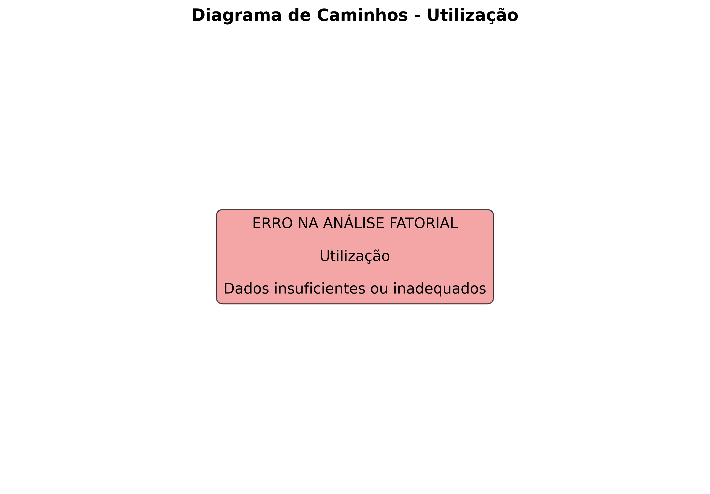

# Relatório SEM - Utilização

## [DADOS] Informações Gerais do Modelo

- **Modelo analisado**: Utilização
- **Número de variáveis**: 8
- **Número de observações**: 703
- **Alpha de Cronbach**: nan (Dados insuficientes)
- **Correlação média entre variáveis**: nan

## [ANALISE] Análise Fatorial

### Adequação dos Dados

⚠️ **Análise fatorial não pôde ser realizada devido à inadequação dos dados.**

## [GRAFICO] Índices de Ajuste do Modelo

| Índice | Valor | Interpretação | Critério |
|--------|-------|---------------|----------|
| CFI | N/A | Não calculado | CFI ≥ 0.90 (Bom), ≥ 0.95 (Excelente) |
| TLI | N/A | Não calculado | TLI ≥ 0.90 (Bom), ≥ 0.95 (Excelente) |
| RMSEA | N/A | Não calculado | RMSEA ≤ 0.08 (Bom), ≤ 0.05 (Excelente) |
| SRMR | N/A | Não calculado | SRMR ≤ 0.08 (Bom), ≤ 0.05 (Excelente) |

## 🎯 Avaliação Geral do Modelo

### 💡 Recomendações

### [DADOS] Visualizações

