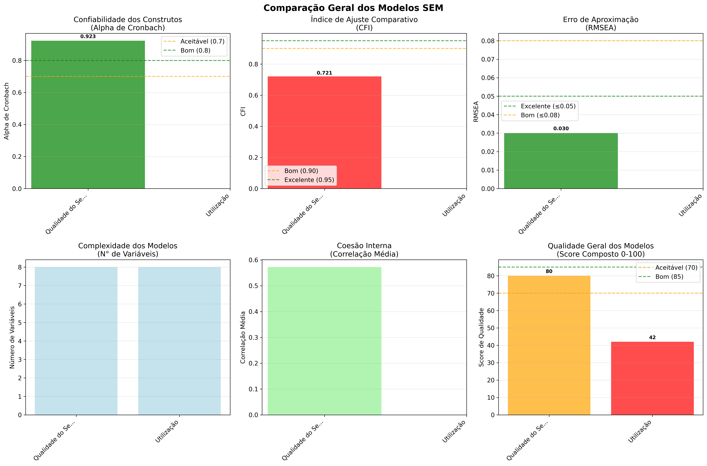

# Relatório Comparativo - Modelos SEM

## 📊 Resumo Geral

Este relatório compara 2 modelos de equações estruturais (SEM) analisados:

| Modelo | Alpha | CFI | RMSEA | Score |
|--------|-------|-----|-------|-------|
| Qualidade do Serviço | 0.923 | 0.721 | 0.030 | 80 |
| Utilização | nan | nan | nan | 42 |

## 🏆 Ranking de Qualidade

1. **Qualidade do Serviço** - Score: 80
   - Alpha de Cronbach: 0.923 (Excelente)
   - CFI: 0.721
   - RMSEA: 0.030

2. **Utilização** - Score: 42
   - Alpha de Cronbach: nan (Dados insuficientes)
   - CFI: nan
   - RMSEA: nan

## 📈 Principais Conclusões

### Confiabilidade (Alpha de Cronbach)
- 1 modelo(s) com confiabilidade excelente (≥ 0.8)
- 0 modelo(s) com confiabilidade aceitável (0.7-0.8)
- 1 modelo(s) com confiabilidade questionável (< 0.7)

### Ajuste dos Modelos (CFI)
- 0 modelo(s) com ajuste excelente (CFI ≥ 0.95)
- 0 modelo(s) com ajuste bom (CFI ≥ 0.90)
- 2 modelo(s) com ajuste inadequado (CFI < 0.90)

### Recomendações

1. **Priorizar o modelo "Qualidade do Serviço"** que apresentou o melhor desempenho geral
2. **Revisar modelos com scores baixos** (< 70) para possíveis melhorias
3. **Considerar coleta de mais dados** para modelos com Alpha < 0.7
4. **Validar resultados** com amostras independentes quando possível

